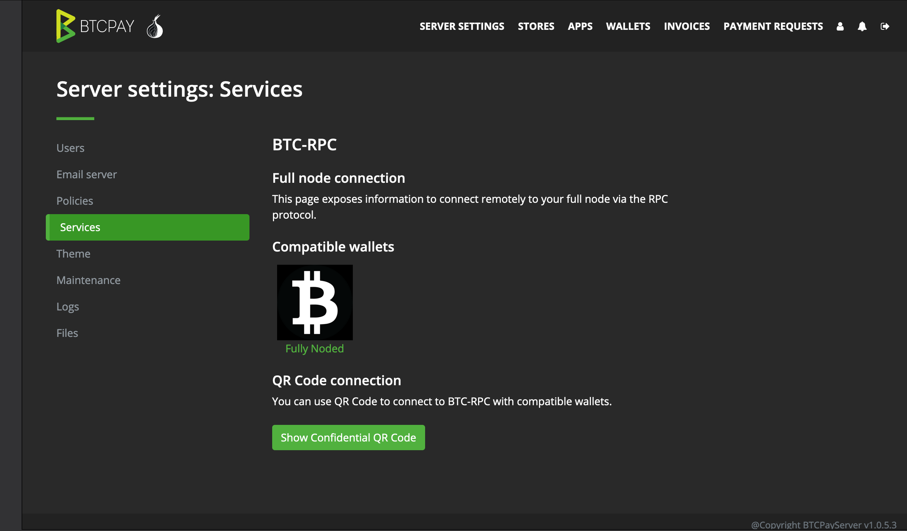
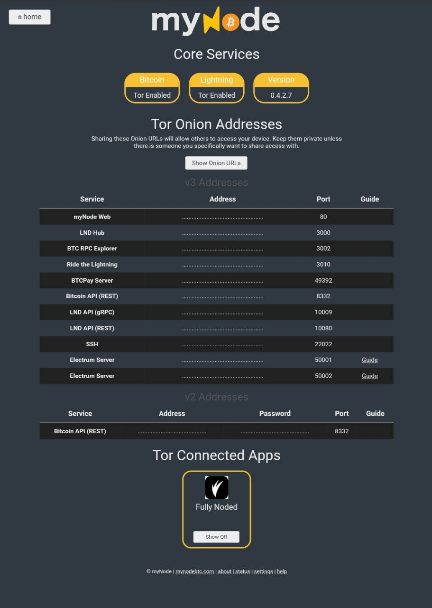

# Connect Your Node

## [Lightning]

Please see [this document](https://github.com/Fonta1n3/FullyNoded/blob/master/Docs/Lightning.md) for connecting your lightning nodes.

## [Bitcoin Core](https://bitcoincore.org/en/releases/)

- On your mac you can install Bitcoin Core or you can configure a Tor hidden service that controls your nodes `rpcport`, for details on how to do that see this [guide](../Tor/Tor.md)
- Find your `bitcoin.conf` which by default can be found in these locations:
    - Linux: `~/.bitcoin/bitcoin.conf`
    - macOS: `~/Library/Application Support/Bitcoin/bitcoin.conf`
    - Windows: `%APPDATA%\Bitcoin\bitcoin.conf`
    - Input your `rpcuser` and `rpcpassword` and a label into the app. **Compatible with [rpcauth](https://github.com/bitcoin/bitcoin/tree/master/share/rpcauth)**. If none exists add them, you can see an example `bitcoin.conf` [here](./bitcoin-conf.md). You always need to restart your node after editing your `bitcoin.conf` for the changes to take effect.
- Back to Fully Noded
- If connecting to a node running on the same mac just input `127.0.0.1:8332` as the address and ignore the next step.
- If connecting via Tor remotely input the hidden service hostname with the port at the end `njcnewicnweiun.onion:8332`.
- Tap `save`, you will be alerted it if was saved successfully, FN will automatically start connecting to it, go to the home screen and watch the magic 🤩

## [BTCPayServer](https://btcpayserver.org)

- In BTCPay go to `Server Settings` > `Services` > click on `Full Node RPC`

- In Fully Noded go to `Settings` > `Node Manager` > `+` > `Scan Quick Connect QR`
- Once you have scanned the QR the app will automatically connect and start loading the home screen, to ensure its working go home and see the table load. To troubleshoot any connection issue reboot your BTCPayServer and force quit and reopen Fully Noded.

## [Nodl](https://www.nodl.it)

- In Nodl go to the Tor tile settings pane which will dsiplay:

- Click `Details and settings`

- If you are on your iPhone or iPad you can click `BTCRPC Link` and it will automatically launch Fully Noded and connect your node.
- If you are accessing the Nodl gui via a computer click `QR-Code`:

- In Fully Noded go to `Settings` > `Node Manager` > `+` > `Scan Quick Connect QR`
- Once you have scanned the QR the app will automatically connect and start loading the home screen, to ensure its working go home and see the table load. To troubleshoot any connection issue reboot Tor on your Nodl and force quit and reopen Fully Noded.

You can always do this manually by inputting your `rpcuser` and `rpcpassword` along with the Tor hidden service url in Fully Noded. Just add `:8332` to the end of the onion url.

## [Raspiblitz](https://shop.fulmo.org/raspiblitz/)

In Raspiblitz:
- Ensure Tor is running
- SSH-MAINMENU > FULLY_NODED
- follow the simple instructions

## [Embassy](https://start9labs.com)

- In Fully Noded go to `Settings` > `Node Manager` > `+` > `manually`
- Simply add the Tor onion url with `:8332` appended to it and your rpc username/password

## [myNode](http://www.mynodebtc.com)

- In myNode:

1. From your dashboard, navigate to the Tor page

2. At the bottom of the Tor page your will see the Fully Nodes button, press it.

3. You will now see your connection QR.
This is for premium myNode users only.
- In Fully Noded go to `Settings` > `Node Manager` > `+` > `Scan Quick Connect QR` and scan the QR

Non premium users can simply get their Tor V3 url for the RPC port add `:8332` to the end so it looks like `ufiuh2if2ibdd.onion:8332` and get your `rpcuser` and `rpcpassword` and add them all manually in Fully Noded:  `Settings` > `Node Manager` > `+` > `manually`
