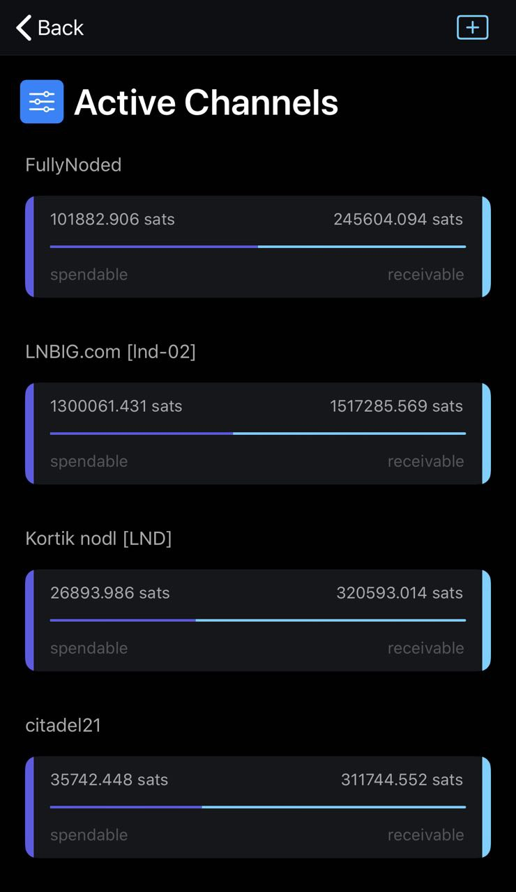

# ⚡️⚡️⚡️Lightning ⚡️⚡️⚡️

### #Reckless

This document explains how to use Fully Noded to remotely connect to and control your c-lightning node via a Tor V3 hidden service.

### TLDR
You need an http server that exposes the lightning-rpc unix domain socket to a port which you must expose to a Tor V3 hidden service.
Add the hostname `jeifeif.onion:port` to Fully Noded > Node Manager > ⚡️ along with the http user and http password you configure with the http server. Thats it. In this guide we use `https://github.com/Start9Labs/c-lightning-http-plugin`, there are others, feel free to try whatever works for you.

### Security
You should take advanatge of Tor V3 auth by exporting the V3 authentication key from Fully Noded > Settings > Security Center > Tor V3 Authentication and add the pubkey to your lightning-rpc `HiddenServiceDir` authorized_clients.

You should disable allowing any incoming connections to the lightning-rpc port and only allow `localhost` to access it. Following these suggestions will go a very long way in ensureing your remote connection to your lightning node is highly secure.

### Step by step

First you need to install c-lightning, to do that follow [this](https://github.com/ElementsProject/lightning/blob/master/doc/INSTALL.md) guide for whichever OS you are on.

If you have c-lightning running already you can stop it. `cli/lightning-cli stop`

### Install and configure Tor

Pick the guide below for the device your're running your node on:
 - [macOS](./Tor/Tor.md/#Connecting-over-MacOS)
 - [Windows 10](./Tor/Tor.md/#Connecting-over-Tor-Windows-10)
 - [Debian 10](./Tor/Tor.md/#Connecting-over-Tor-Linux-Debian-10)

### Create lightning config

If you haven't created a lightning config file now is a good time to do that.
```
cd /home/you/.lightning
nano config
```
paste in the following config which is ideally suited to Fully Noded usage:
```
alias=FullyNoded
network=testnet
log-file=/home/you/.lightning/lightning.log
plugin=/home/you/.lightning/plugins/c-lightning-http-plugin/target/release/c-lightning-http-plugin
log-level=debug:plugin
http-pass=aPasswordYouWillSoonCreate
http-port=1312
```

### Create the log file
`mkdir /home/you/.lightning/lightning.log`

### Setup c-lightning-http-plugin

Create a directory for the plugins we need:<br/>
`mkdir /home/you/.lightning/plugins/`

Download the plugin:<br/>
`git clone https://github.com/Start9Labs/c-lightning-http-plugin.git`<br/>

Compile the plugin (it's built in Rust so first install Rust):<br/>
`curl --proto '=https' --tlsv1.2 -sSf https://sh.rustup.rs | sh`<br/>
Close the terminal and reopen it so that the Rust command `cargo` is automatically added to your `path`<br/>
```
cd /home/you/.lightning/plugins/c-lightning-http-plugin
cargo build --release
```
When it finishes building give it permissions:<br/>
`chmod a+x /home/you/.lightning/plugins/c-lightning-http-plugin/target/release/c-lightning-http-plugin`<br/>

### Start lightningd

Start lightning:<br/>
`cd /home/you/lightning`<br/>
`./lightningd/lightningd`<br/>

### Connect Fully Noded

In Fully Noded go to Home screen  and tap the  ⚡️, from there you will be automatically prompted to add a node:<br/>
- add a label
- add the rpc user: `lightning`
- add the rpc password which is the `http-pass` you added to the config from above: `aPasswordYouWillSoonCreate`
- add the onion address (hostname) we created earlier, ensure you add the port at the end: `theHostnameYouJustSavedFromThePreviousSteps.onion:1312`

Thats it, Fully Noded will now automatically use those credentials for any lightning related functionality. You can only have one lightning node at a a time, to add a new one just overwrite the existing credentials.

In Fully Noded you will see lightning bolt ⚡️ buttons in a few places, tap them to see what they do.

From v0.1.72 FN has a nice new visualization for your active lightning channels and a lightning button from home node view to access your lightning node<br/>
<a href="../Videos/IMG_3163.MP4" target="_blank"></a>

### Invoices
For invoices, Fully Noded by default creates on-chain invoice's from your Bitcoin Core node, tap the lightning bolt to create a lightning invoice, you can add optional amount (btc) and label for the bolt11 invoices.

### Balances
Fully Noded no longer differentiates between hot and cold balances. Your balances now shows an on-chain 🔗 balance and a lightning ⚡️ balance.

### Transaction history
The transaction history will automatically show any lightning related on-chain transactions (deposits/withdraws to your lightning wallet) as well as your Bitcoin Core wallet's on-chain transaction.

Any lightning related transaction will have a ⚡️ icon and any on-chain transactions will have a 🔗 icon, you will see funding and withdraw transactions with both a ⚡️ and 🔗icon because they are related to both your on-chain and lightning wallet. On-chain transactions are always denominated in btc, off-chain transactions always denominated in sats.

### Sending transactions
On the "send" view you will see some new lightning ⚡️ buttons.

### Deposit to your lightning wallet
Just above the address text input field there is a lightning ⚡️button, this will fetch a deposit address from your lightning node so you can easily deposit to it from your on-chain node's wallet.

### Withdraw from lightning wallet
There is a lightning ⚡️in the top right too, that is for withdrawing from your lightning node to whatever address you provide, amounts will be denominated in btc or USD depending on which currency you have selected (you can tap the coin button to toggle currency types).

### Paying invoices
In this view you can always paste in or scan a bolt11 invoice with an optional amount filled in, if the bolt11 invoice does not specify an amount you must fill one out in the amount input text field.

### Channel management
For creating channels go to "settings" > "node manager" > ⚡️ > ⚙️:
This will fetch all your peers and display their ID's. You can tap each one to see the raw json data from your c-lightning node.

You can tap the + button to scan a QR (that consists of <publicKey>@IP:port>) to connect to a peer, create and fund a channel.

First add an amount in satoshi's which you want to to commit to the channel.

Scanning a valid node url will trigger a series of calls:

- we establish a connection
- create a channel
- fund the channel (from your lightning wallet's on-chain wallet)
- confirm that the funding is secured

If all goes well you will get a success message, if not you'll get an error.

Thats it for now! It is a bit rough and ready but very functional, please report bugs, crashes and feature requests ⚡️⚡️⚡️⚡️⚡️⚡️⚡️
