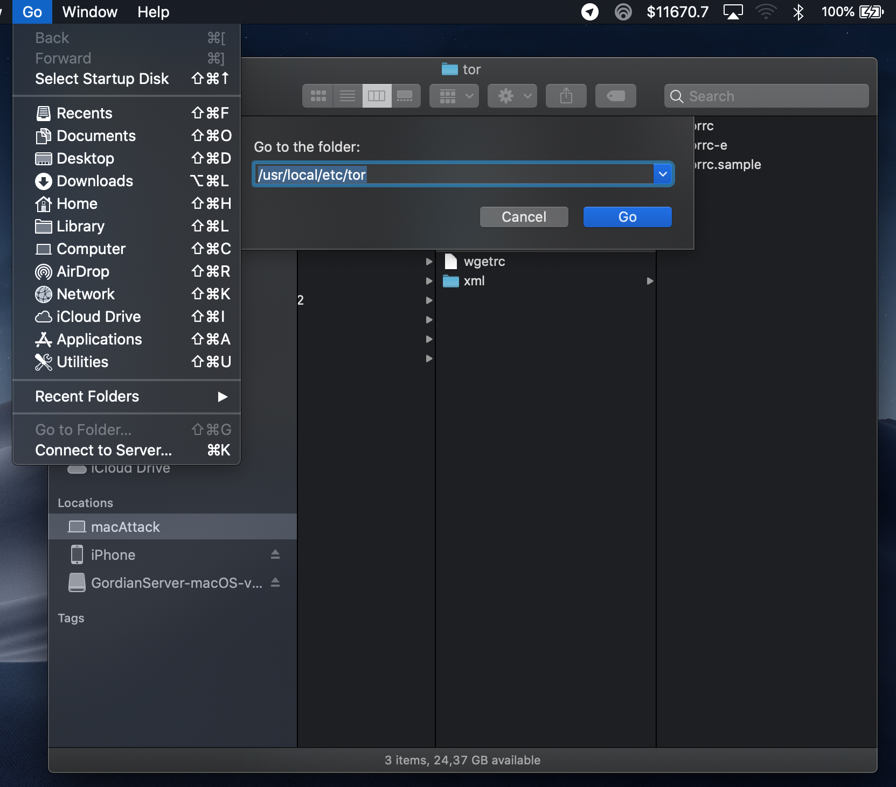
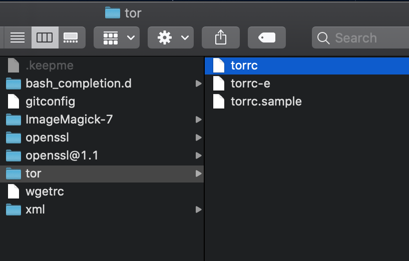
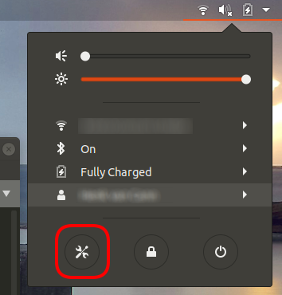

# Setting up Tor

**The below guides walk you through how to install Tor and setup your own hidden service which is what Fully Noded needs to connect to**

 - [macOS](#macOS)
 - [Windows 10](#Windows-10)
 - [Linux](#Linux)

## macOS

- 1. Install `brew` **for M1 macs you may need to prefix all brew related commands with arch -x86_64 so that they look like `arch -x86_64 brew <command>`**
    - `brew` is a really common program on macOS so its a good idea to first check if you already have it:
        - Open a terminal and run the command: `brew --version`
        - If you got a valid response you can skip to the next step, if not then install brew with:
            - `/bin/bash -c "$(curl -fsSL https://raw.githubusercontent.com/Homebrew/install/master/install.sh)”`
            - Let `brew` finish installing, once it has move to the next step.
- 2. Install `tor`
    - In a terminal run `brew install tor` 
        - Once tor finishes installing we need to configure it to run a hidden service for us. The hidden service is what we use to connect to our node remotely. A hidden service simply exposes a specific port on your computer to the Tor network via a super secret URL which is called a `hostname`, the `hostname` is nothing more then a web address for the Tor network. Its important to remember these are secret, only you will know about it unless you intentionally give it to others.
        - Start `tor` by opening a terminal and running `brew services start tor`, ensure it starts
        - Stop `tor` by running `brew services stop tor`, ensure it stops
- 3. Configure `tor`
    - Open Finder and click the `Go` button on the top menu bar then click "Go to Folder" or simply type `shift command g`:<br/>
        <br/>
    - Paste in `/usr/local/etc/tor/`
    - Double click the `torrc` file:<br/>
        <br/>
        - Select all of its contents and delete it. Paste in the contents of the sample torrc file we provide [here](./torrc-tailored.md) (do not include the explainer at the top, just they `grayed` out text)
        - If you do not want to overwrite your entire `torrc` you can instead paste the following hidden services in to the existing `torrc`, look for the `HiddenServices` section and paste the following into it:
        ```
        HiddenServiceDir /usr/local/var/lib/tor/fullynoded/main
        HiddenServiceVersion 3
        HiddenServicePort 8332 127.0.0.1:8332

        HiddenServiceDir /usr/local/var/lib/tor/fullynoded/test
        HiddenServiceVersion 3
        HiddenServicePort 18332 127.0.0.1:18332

        HiddenServiceDir /usr/local/var/lib/tor/fullynoded/regtest
        HiddenServiceVersion 3
        HiddenServicePort 18443 127.0.0.1:18443

        HiddenServiceDir /usr/local/var/lib/tor/fullynoded/lightning
        HiddenServiceVersion 3
        HiddenServicePort 1312 127.0.0.1:1312
        ```

    - Save the newly edited `torrc` file with `command s`
    - Start `tor` with `brew services start tor`
- Congratulations, you just installed and configured your first ever Tor hidden service for your own node! 🎉 🎊 🥳 - One more step!
- 4.  Get your `hostname`
    - Open Finder and again either click "Go" from the top menu bar or simply type `shift command g` and paste in the following path `/usr/local/var/lib/tor/fullynoded/main`
        - If you want to use testnet we got you covered, just go here instead `/usr/local/var/lib/tor/fullynoded/test`
    - Double click `hostname`, you need to copy this hostname into Fully Noded along with its port at the end. For mainnet the port is `8332` for testnet `18332`
    - `4tbssic3c6uu2lzfvhmsmfjlvwm4gk26qqvutzmnr6gmtszp5wujotqd.onion:8332` as a mainnet example

That is it as far as Tor is concerned from here you can continue where we left off at [Connect.md](../Bitcoin-Core/Connect.md)

## Windows 10

If you already have the Tor Expert Bundle installed you can skip the first 3 steps.

- Download the Tor Expert Bundle [here](https://www.torproject.org/download/tor/)
- Unpack the "Tor" folder onto your C: drive.
- Open PowerShell as admin (Press Windows Key + X and then select PowerShell (Admin))

Now we have Tor on our drive, but we still have configure and install it.

Let's enter the directory in Powershell:
`cd C:\Tor`
Now we're in the Tor directory.
In order to configure Tor we'll have to generate a configuration file:
`echo > torrc`
Now we launch notepad and edit the file to fit our needs:
`notepad torrc`
Enter the following into the file:
```
HiddenServiceDir "C:/Tor/fullynoded/main/"
HiddenServiceVersion 3
HiddenServicePort 8332 127.0.0.1:8332

HiddenServiceDir "C:/Tor/fullynoded/test/"
HiddenServiceVersion 3
HiddenServicePort 18332 127.0.0.1:18332

HiddenServiceDir "C:/Tor/fullynoded/regtest/"
HiddenServiceVersion 3
HiddenServicePort 18443 127.0.0.1:18443

HiddenServiceDir "C:/Tor/fullynoded/lightning/"
HiddenServiceVersion 3
HiddenServicePort 1312 127.0.0.1:1312
```

Save and exit the file.

Now we have to create the directories:
```
cd C:\Tor
mkdir fullynoded
mkdir fullynoded\main
mkdir fullynoded\test
mkdir fullynoded\regtest
mkdir fullynoded\lightning
```

Save and exit the file.
Now we install Tor as a service:
`C:\Tor\tor.exe --service install -options -f "C:\Tor\torrc"`

Now we can enable the service by typing:
`C:\Tor\tor.exe --service start`

After you start the service the hostname files will be generated in `C:\Tor\fullynoded\main`, `C:\Tor\fullynoded\test`, `C:\Tor\fullynoded\regtest` and `C:\Tor\fullynoded\lightning`, you can view them by typing:<br/>
`cat C:\Tor\fullynoded\main`<br/>
`cat C:\Tor\fullynoded\test`<br/>
`cat C:\Tor\fullynoded\regtest`<br/>
`cat C:\Tor\fullynoded\lightning`<br/>

Next you need to ensure your `bitcoin.conf` has rpc credentials added (see next section).

Once you have rpc credentials added to your `bitcoin.conf` you can reboot Bitcoin-Core.

Find the suggested Authentication settings on the device running FN [here](./Authentication.md/#On-the-device-running-FN).<br/>
Find the suggested `bitcoin.conf` settings for FN [here](./Howto.md/#Bitcoin-Core-settings).<br/>
Find the suggested `lightning.conf` settings for FN [here](./Lightning.md/#Create-lightning-config).

## Linux

Install tor on linux, follow this guide [here](https://2019.www.torproject.org/docs/debian.html.en).
1. The guide uses your input to adapt the commands you have to give in. It uses the instructions from the tor project website. They cover all platforms.
2. The guide is very strict about **what you have to do as 'root'. Follow those rules**. It can be practical to open a terminal tab and change the user of that tab to root with `su - root`. That needs the root password. No to be confused with the 'sudo ...' commands. Those need the user who is logged in and has sufficient rights to execute as superuser.

## Example covers connecting over Tor Ubuntu 18
.... but I should work the same for all Linux platforms. Later this example will be more specifically directed towards:<br/>
 - the location `/var/lib/tor/*` where tor landed, but that could have been elsewhere in your directory structure too.
 - the HiddenServiceDir *lightning*, but that could have been main, test, regtest or standup, as you wish (see below)

### Finding your Operating System version details
Click the down arrow, often in the upper right corner of your screen:<br/>

<br/>
Copy the "About" <br/>
<br/>

### Use the installation guide on the Tor website
[Here](https://2019.www.torproject.org/docs/debian.html.en) again the link to the instruction. Choosing the right pull down menu-items and the text below with your commands will change accordingly:<br/>
<br/>

### Where has Tor been installed?

It depends on the setup of the OS whether tor gets parked in `var/lib/tor/*` instead of `usr/local/var/lib/tor/*` for example.

Check wether you are in `/usr/local/var/lib/tor` ... or in `/var/lib/tor` ...

This command could come in handy: `find / -name tor -type d 2> /dev/null` The result will tell you which absolute paths the system has installed tor into. The `2> /dev/null` redirects permission denied errors to the void.
```
$ find / -name tor -type d  2> /dev/null
/var/lib/tor
/var/log/tor
/run/tor
/usr/share/tor
/usr/share/doc/tor
/etc/tor
```
### On the device running your node:

Boot tor as a service:
Linux: `systemctl start tor`

Once Tor is installed (and started) you will be able to create a Hidden Service.

On Linux start your text-editor, e.g. nano:<br/>
`nano /etc/tor/torrc`<br/>

Find the hidden services section:<br/>
```
############### This section is just for location-hidden services ###

## Once you have configured a hidden service, you can look at the
## contents of the file ".../hidden_service/hostname" for the address
## to tell people.
##
## HiddenServicePort x y:z says to redirect requests on port x to the
## address y:z.
```

Below it add the hidden service we will use to control our Bitcoin node and lightning node:<br/>
```
HiddenServiceDir /var/lib/tor/fullynoded/main
HiddenServiceVersion 3
HiddenServicePort 8332 127.0.0.1:8332

HiddenServiceDir /var/lib/tor/fullynoded/test
HiddenServiceVersion 3
HiddenServicePort 18332 127.0.0.1:18332

HiddenServiceDir /var/lib/tor/fullynoded/regtest
HiddenServiceVersion 3
HiddenServicePort 18443 127.0.0.1:18443

HiddenServiceDir /var/lib/tor/fullynoded/lightning/
HiddenServiceVersion 3
HiddenServicePort 1312 127.0.0.1:1312
```
`ctlr x` > `y` > `return` to save the changes and quit nano text editor

You will then need to create the hidden service directory:<br/>
`cd /var/lib/tor/`<br/>
`mkdir fullynoded`<br/>
`mkdir fullynoded/main`<br/>
`mkdir fullynoded/test`<br/>
`mkdir fullynoded/regtest`<br/>
`mkdir fullynoded/lightning/`

On linux assign the owner for every *subdirectory* above, here example *lightning*:<br/>
`chown -R debian-tor:debian-tor /var/lib/tor/fullynoded/lightning/`

Then:<br/>
`chmod 700 /var/lib/tor/fullynoded/lightning/`

#### Rights in the tree that work:
```
$ namei -l /var/lib/tor/fullynoded/lightning
f: /var/lib/tor/fullynoded/lightning
drwxr-xr-x root       root       /
drwxr-xr-x root       root       var
drwxr-xr-x root       root       lib
drwx--S--- debian-tor debian-tor tor
drwxr-sr-x debian-tor debian-tor fullynoded
drwx--S--- debian-tor debian-tor lightning
```
Restart Tor:<br/>
linux `systemctl restart tor`

## Expected result

Tor should start and you should be able to **navigate to** your onion address(es) you need for Fully Noded, the example is for subdirectory *main* but it should be done for all subdirectories if relevant for you:<br/>
    * `/usr/local/var/lib/tor/fullynoded/lightning` (the directory for *lightning* we added to the torrc file) and see a file called `hostname`, **open it and copy the onion address, that you need for Fully Noded**.
    * Or `cat /usr/local/var/lib/tor/fullynoded/lightning/hostname`. If it prints something like `ndfiuhfh2fu23ufh21u3bfd.onion` then all is well, if not message me on the Fully Noded Telegram and some group member can help (maybe).
    * Do the same for `test`, `regtest` and `main` if you wish to configure tor for those networks too.

Find the suggested Authentication settings on the device running FN [here](./Authentication.md/#On-the-device-running-FN).<br/>
Find the suggested `bitcoin.conf` settings for FN [here](./Howto.md/#Bitcoin-Core-settings).<br/>
Find the suggested `lightning.conf` settings for FN [here](./Lightning.md/#Create-lightning-config).

## Troubleshooting

You can check Tor configuration and restart with: <br/>
```
sudo journalctl -u tor@default | tail -40
```
To get the helpful log output of the last 40 lines.

An example section of the journal (log) that looks promising:
```
aug 27 22:58:36 linux-laptwwop tor[1043]: Configuration was valid
aug 27 22:58:36 linux-laptwwop tor[1073]: Aug 27 22:58:36.722 [notice] Tor 0.4.3.6 running on Linux with Libevent 2.1.8-stable, OpenSSL 1.1.1, Zlib 1.2.11, Liblzma 5.2.2, and Libzstd 1.3.3.
aug 27 22:58:36 linux-laptwwop tor[1073]: Aug 27 22:58:36.722 [notice] Tor can't help you if you use it wrong! Learn how to be safe at https://www.torproject.org/download/download#warning
aug 27 22:58:36 linux-laptwwop tor[1073]: Aug 27 22:58:36.722 [notice] Read configuration file "/usr/share/tor/tor-service-defaults-torrc".
aug 27 22:58:36 linux-laptwwop tor[1073]: Aug 27 22:58:36.722 [notice] Read configuration file "/etc/tor/torrc".
aug 27 22:58:36 linux-laptwwop tor[1073]: Aug 27 22:58:36.724 [notice] Opening Socks listener on 127.0.0.1:9050
aug 27 22:58:36 linux-laptwwop tor[1073]: Aug 27 22:58:36.725 [notice] Opened Socks listener on 127.0.0.1:9050
aug 27 22:58:36 linux-laptwwop tor[1073]: Aug 27 22:58:36.725 [notice] Opening Control listener on 127.0.0.1:9051
aug 27 22:58:36 linux-laptwwop tor[1073]: Aug 27 22:58:36.725 [notice] Opened Control listener on 127.0.0.1:9051
aug 27 22:58:37 linux-laptwwop systemd[1]: Started Anonymizing overlay network for TCP.
```
