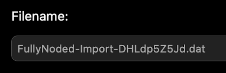
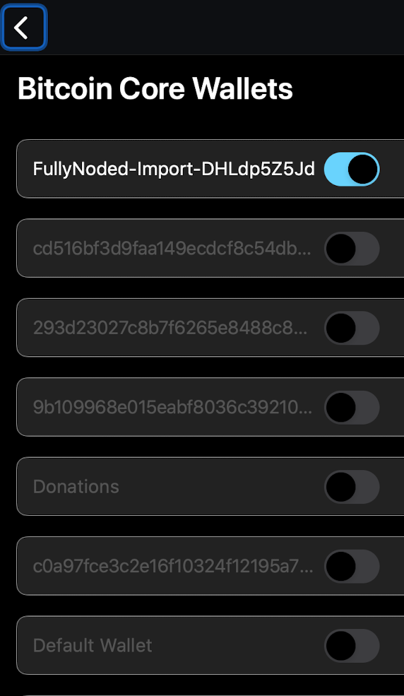

# Deleting Wallets

There are differences in *Fully Noded Wallets* versus *Bitcoin Core Wallets*, you can read a detailed explanation on the website [here](https://fullynoded.app/faq/#How-Do-I-Delete-a-Wallet).

You can not completely delete a *Bitcoin Core Wallet* from the Fully Noded app, you must do it on your node.

For *Fully Noded Wallets* you can delete the apps database for the wallet by tapping the "trash" button from the "Wallet Detail" view which will cause the app to forget about the wallet, however it can still be accessed as a *Bitcoin Core Wallet* by tapping `advanced` > `Bitcoin Core Wallets`.

To delete the `Bitcoin Core Wallet` you need to navigate to your nodes wallets directory which can generally be found in your Bitcoin Core's default data directory:
* Linux: `~/.bitcoin/wallets`
* macOS: `~/Library/Application Support/Bitcoin/wallets`
* Windows: `%APPDATA%\Bitcoin\wallets`

  

You can cross reference *Fully Noded Wallets* by tapping the "info" button from the "Active Wallet" tab and looking for the `Filename` field.

  

You can cross reference *Bitcoin Core Wallets* filenames by navigating to `advanced` > `Bitcoin Core Wallets`, the text you see is the wallets filename.
