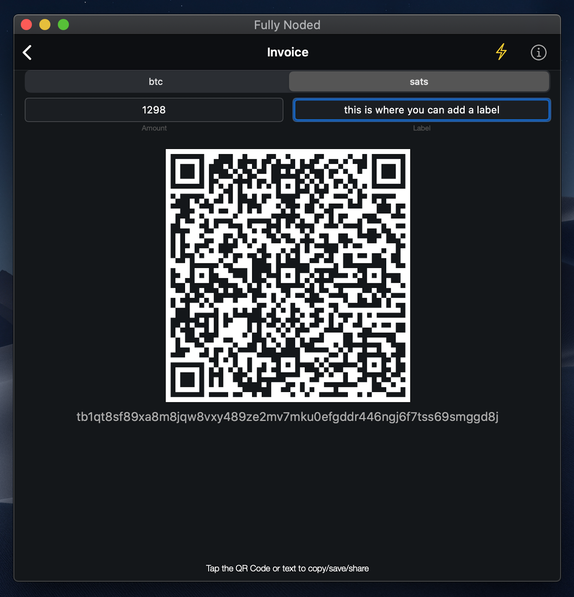

# Receiving

 

Receiving is as simple as tapping "invoice" from the "Active Wallet" tab.

An address will be fetched from your node using `bitcoin-cli getnewaddress` for the "Active Wallet".

By default these invoices are BIP21 compatible, you may add a BIP21 amount and label by filling out the respective text fields.

If you have added a c-lightning node you can tap the ⚡️ button to create a bolt11 invoice, editing the amount and label for lightning invoices does not happen in "real time" like the bitcoin invoices do. To edit the label and amount you will need to always tap the ⚡️ for the new values to take effect by creating a new invoice. By default lightning invoices are "any" types meaning no amount is specified. Some lightning wallets are not compatible with "any" invoices, so if you have an issue specify an amount then tap the ⚡️ button. Amounts will always get converted to milli satoshis on the backend, so you may either select btc or satoshis and the app will convert the amount accordingly.

Advanced users have the option to derive different address scripts by navigating to "Active Wallet" tab > `advanced` > `Address script type` however this should be used with caution, it is compatible with your nodes default wallet, Fully Noded single signature wallets and Coldcard single signature wallets. It will also always work if your wallet has a Fully Noded signer associated with it. **IF IN DOUBT STICK WITH THE DEFAULTS**
