# Sending

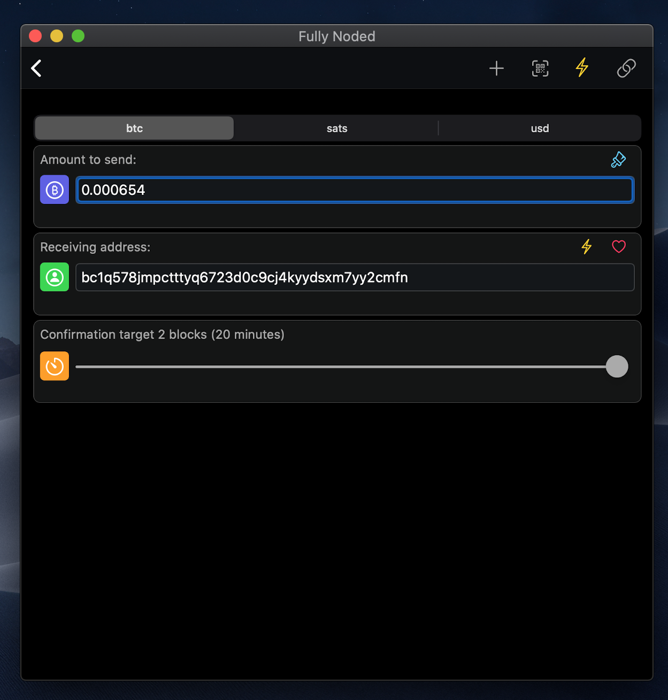 

Sending in Fully Noded is as simple as tapping the "send" button from the "Active Wallet" tab, inputting an amount, a recipient address and tapping the 🔗 button to create a normal (onchain) Bitcoin transaction. However there is more to it then that and you should be aware of all your options and what it all means.

- [PSBT](#PSBT)
- [Raw Transaction](#Raw-Transaction)
- [Transaction fee](#Transaction-fee)
- [Lightning](#Lightning)
- [Donation](#Donation)
- [Sweeping](#Sweeping)
- [Batching](#Batching)
- [BIP21](#BIP21)
- [Currencies](#Currencies)
- [Replace By Fee](#Replace-By-Fee)

## PSBT

  

All psbt functionality is BIP174 compatible.

Fully Noded is capable of creating either a fully signed raw transaction or psbt depending on whether the wallet is watch-only, hot, or multi-sig which can not be fully signed by the app itself.

If Fully Noded and your node do not hold the private keys necessary to fully sign the transaction you will get presented with a psbt and have the option to export it in a number of formats.

You may also tap, double click, or airdrop a `.psbt` file to Fully Noded and it will automatically launch, attempting to sign the psbt and will either allow you to export the updated psbt again or if it is complete will finalize it and convert it to a raw transaction which can be broadcast.

## Raw Transaction

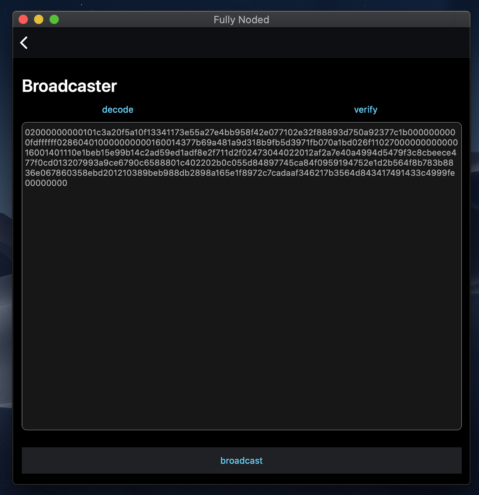 

If the transaction can be signed and is complete then Fully Noded will present you with a signed raw transaction in hex format. You may at any time tap, double click or airdrop a `.txn` file to your device or MacBook and Fully Noded will automatically launch and display the "Broadcaster" for you.

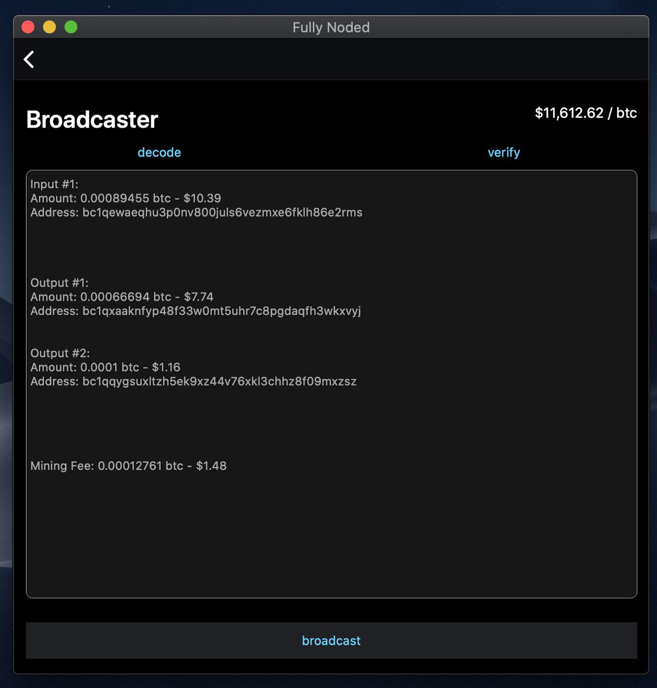 

It is recommended to always use the "verify" button.

The verify button inspects and parses each input and output individually, displaying the amount and address associated with each as well as manually calculating the mining fee and the usd amount for each. This serves the purpose of allowing you to inspect the transaction and make sure nothing looks obviously out of whack.

Usually there will be a change output. You can confirm the change address is yours by copying it > "tools" tab > "wallet" > "get address info". It will automatically paste the address and fetch the address info, if you `solvable=1` in the returned data then you can rest assured the address is yours, this is only something you need to do if you are paranoid.

There is no reason that you need to immediately broadcast the transaction. You can copy and paste it and save it for broadcasting later, which gives you ample time to inspect it.

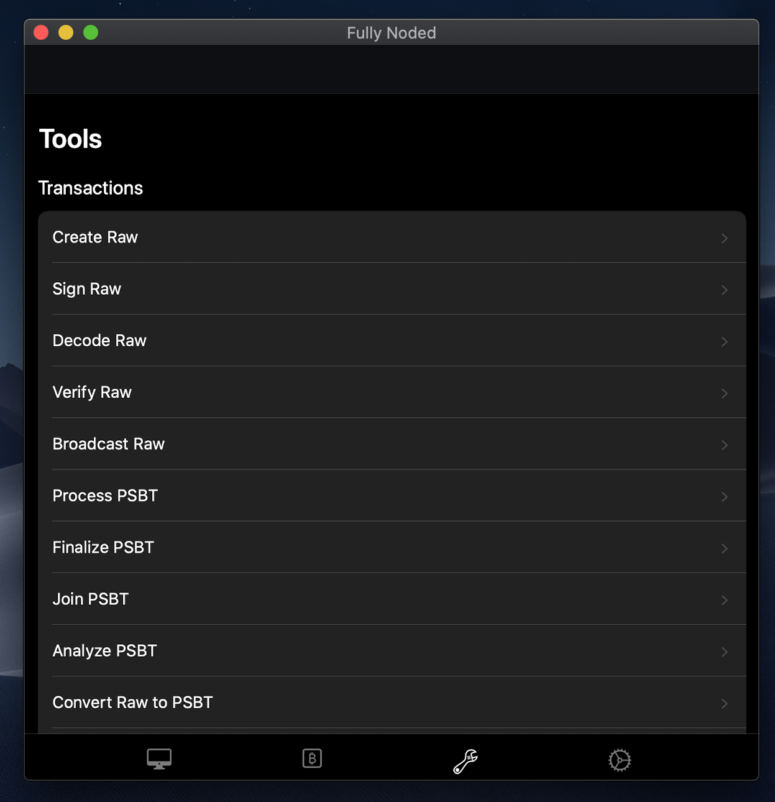 

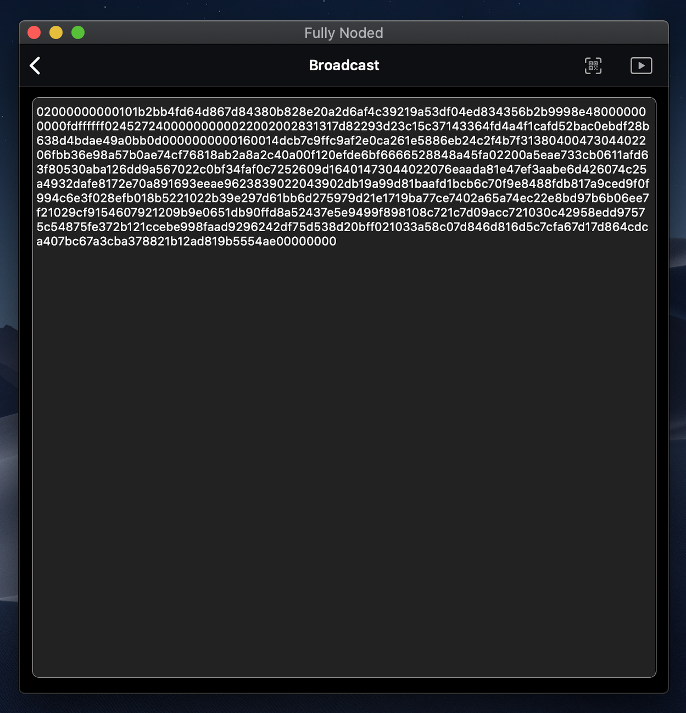 

You may broadcast any signed raw transaction with Fully Noded not just ones your wallet creates. This can be accessed as shown above by "tools" > "transactions" > "broadcast".

When ready you can tap "broadcast" (or the play button for the generic tool) and you may either broadcast the transaction with your own node, or by using Blockstream's Esplora API over Tor. Using someone else's node to broadcast your transaction is much more private than broadcasting it with your own node even though this may seem counterintuitive. Once the transaction has been successfully broadcast you will get a valid transaction ID and a success message and the transaction will appear in your transaction history.

## Transaction fee

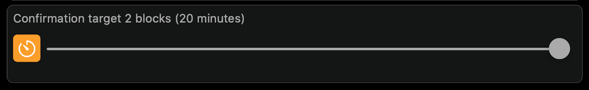 

At the bottom of the screen you will see a "Confirmation target" slider.

The slider can be used to change the number of blocks in which we want our transaction to be confirmed (mined) in. Since each block takes about ten minutes to mine we can convert blocks to time, therefore setting the slider to two blocks will create a fee for your transaction which aims to get the transaction mined into a block within twenty minutes. The lower the number of blocks the higher your fee will be. **This is a rough target! It is not an exact science.** If you need the transaction to be confirmed quickly set it to the minimum target which is two blocks. This uses your node's built in fee estimation algorithm. Transactions are always RBF enabled in Fully Noded, however you always **need a balance** to utilize RBF. If you sweep your wallet (spend everything) and that transaction is not getting confirmed you will **NOT** be able to use RBF because you have no funds with which to RBF the transaction. Fully Noded is not yet capable of CPFP so please exercise caution when sweeping by setting a high mining fee.

## Lightning

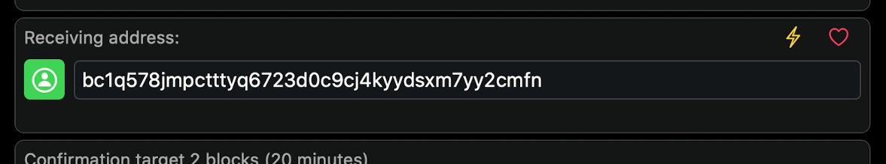 

You will see the ⚡️ button in a few places.

On the "Receiving address" field the ⚡️ button will fetch a funding address for your lightning wallet. You can think of this as a way to deposit funds to your lightning wallet.

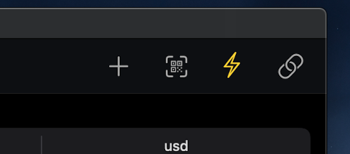 

The larger ⚡️ button in the top right is for withdrawing funds from your lightning wallet to whichever address you specify.

## Donation

 

The ♥️ button is for generating a donation address, this address is derived from a hard coded xpub in the app which I control and hold the seed words to. Your donations are greatly appreciated and support continued development of the app.

## Sweeping

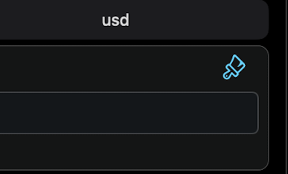 

The sweep button will automatically sweep all your funds to the address provided. It is highly recommended to use a high fee setting when sweeping wallets as you will not be able to use RBF if fees spike while your transaction is unconfirmed.

## Batching

 

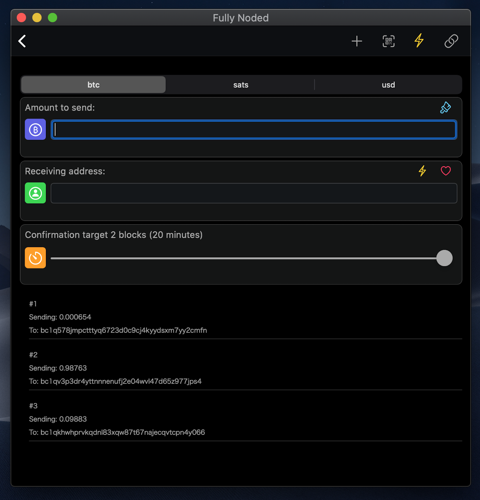 

The + button is for batching transactions, You can add a recipient address, an amount then tap the + button to add multiple outputs. This is great if you need to send multiple transactions at once and want to save on fees. Once you have added all the outputs you want just tap the 🔗 button to create the transaction.

## BIP21

 

You can tap the QR scanner to scan BIP21 invoices or addresses. Generally if you are paying for something with btc on a website they will provide you with a QR code, this can be scanned or uploaded by tapping the QR button. Just tap the 🔗 button to create the transaction after scanning the invoice.

## Currencies

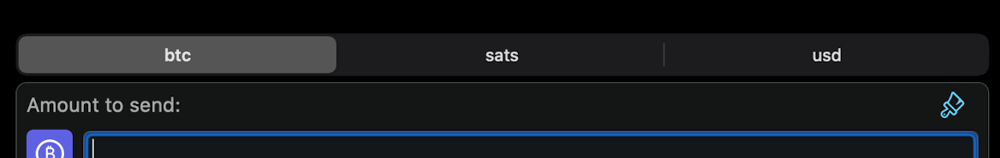 

You can select denominations of `btc` (Bitcoin), `sats` (satoshis) and `usd`. Selecting `usd` will trigger the app to refresh the exchange rate and convert the dollar specified amount to an amount in btc, please be aware of Bitcoin's volatility and that by the time someone receives the btc the exchange rate may have changed.

## Replace By Fee

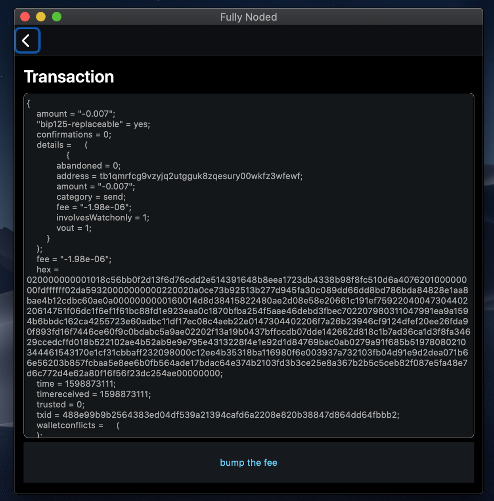 

**You always need a balance to utilize RBF, RBF will not work when you sweep a wallet**

By default all transactions created by Fully Noded are [RBF](https://en.bitcoin.it/wiki/Replace_by_fee) enabled. To take advantage of this tap the transaction from the "Active Wallet" tab and then tap "bump fee" button.

Under the hood an entirely new transaction is created with a higher fee, if Fully Noded can not completely sign the transaction it will present you with a psbt as normal, you will need to pass it to your signer and then back to Fully Noded to broadcast the higher fee transaction again and overwrite the original low fee transaction.

 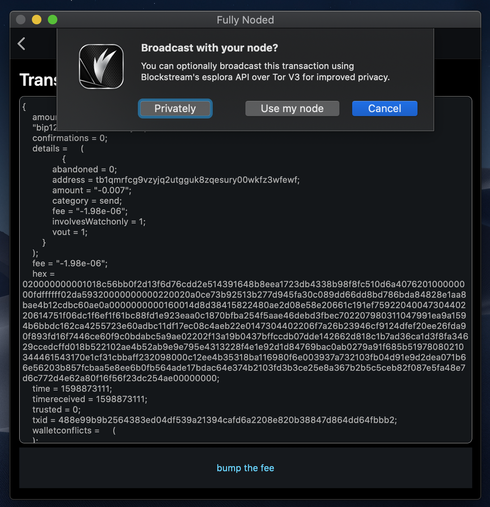 

If FN can complete the transaction it will automatically sign and broadcast the transaction at this point.

 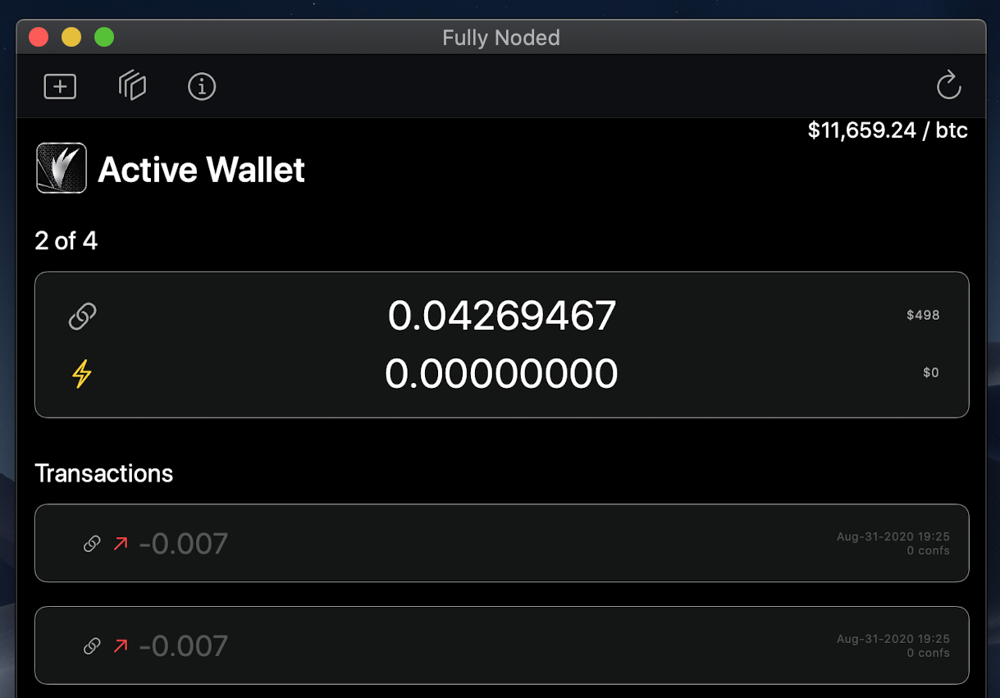 

The final result will be multiple almost identical (only the fee will have changed) transactions on your "Active Wallet" tab.
