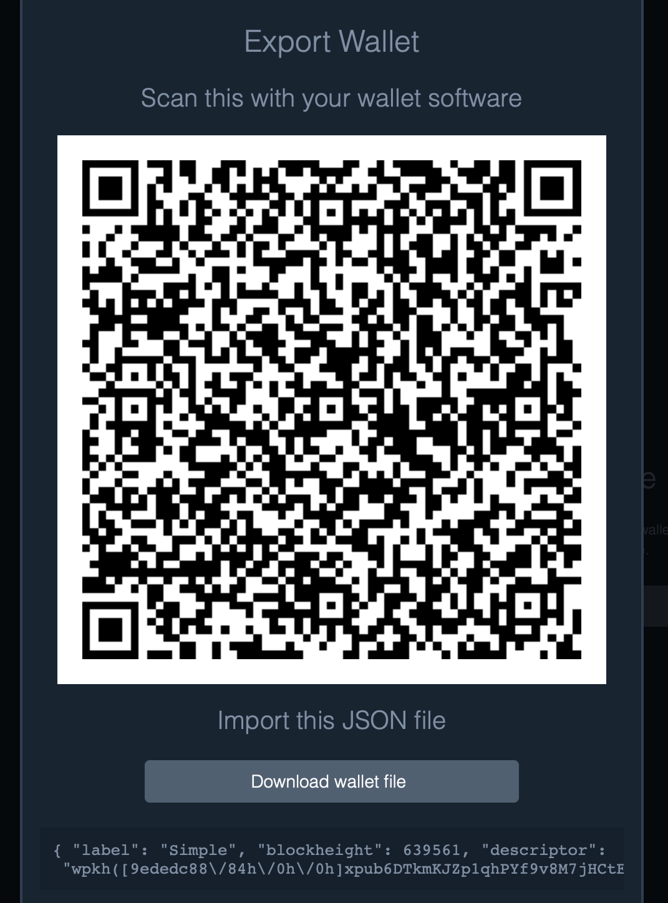

# Specter

## Importing a wallet from Specter
- In Specter click the wallet of your choice, Fully Noded is compatible with all of them
- Click `Settings`

- Click `export`

- In Fully Noded go to the `Active Wallet` tab > `+`  > `import` > scan the Specter export QR code
