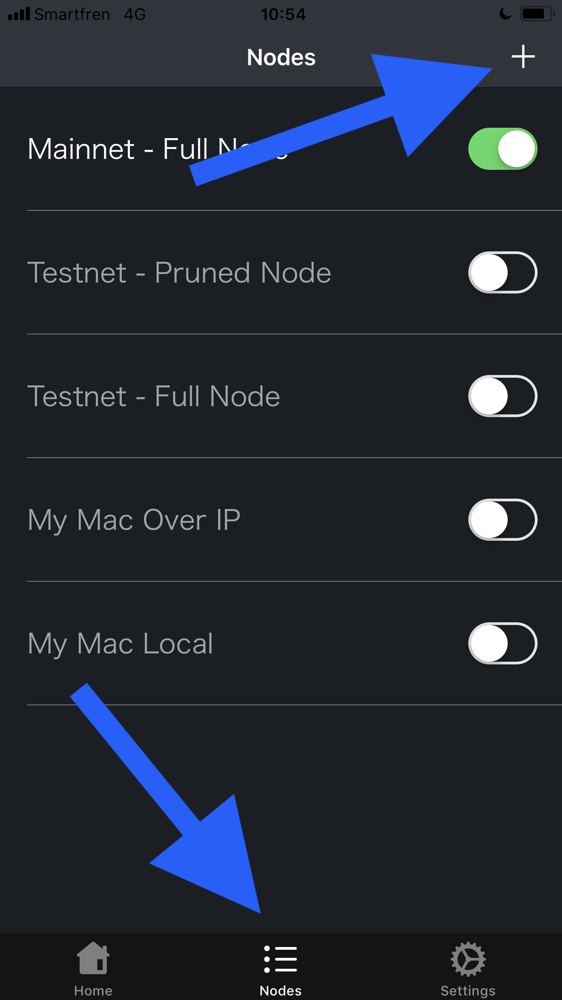
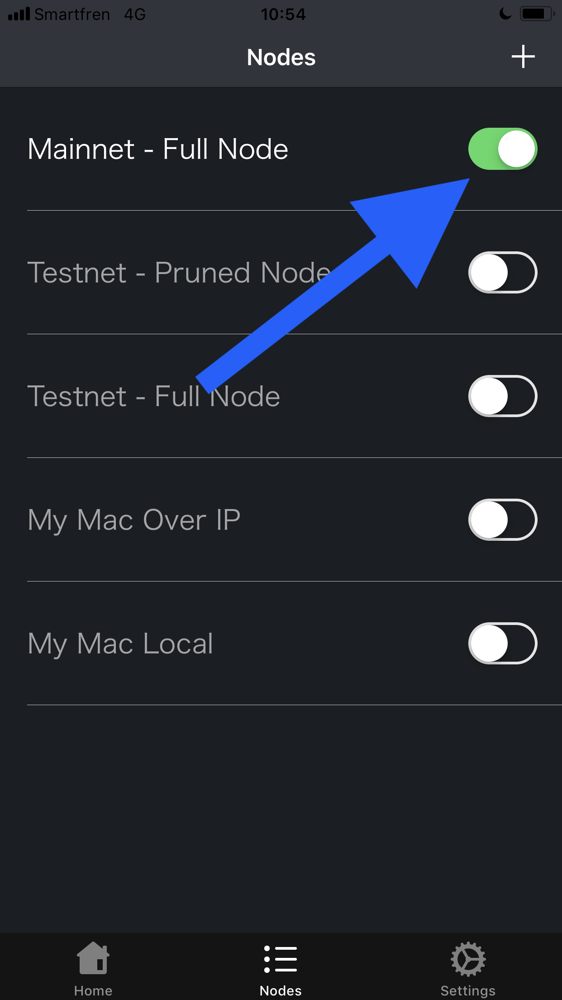

# FullyNoded
A Bitcoin Core GUI for iOS devices. Allows you to connect to and control multiple nodes via SSH.

## Join the Testflight

[Download the testflight on your iOS device by tapping here](https://testflight.apple.com/join/PuFnSqgi)

## Changes v1.46

- Update to Swift 5 / Xcode v10.2.1
- Replaced [AES256CBC](https://github.com/SwiftyBeaver/AES256CBC) with [CryptoSwift](https://github.com/krzyzanowskim/CryptoSwift)
- Replaced [Swift Keychain Wrapper](https://github.com/jrendel/SwiftKeychainWrapper) with [keychain-swift](https://github.com/evgenyneu/keychain-swift)
- The replaced libraries are not maintained/updated or as widely used, which is why we switched, this is a breaking change which forced us to delete all your previous node credentials and encryption key and use these updated libraries instead.
- Automatically add and connect to a testnet node so users may test the app properly before adding their own node. (this does not happen if building from source).
- Added the ability to use Tor in the app to connect to your nodes V3 hidden service, however this is only working in the simulator for now, if you can help debug why it is only working in the simulator please do reach out, if it does work on your device please do let us know about it.
- Added "Utilities" button on the home screen which allows users to take advantage of the "multiwalletrpc" which allows you to create wallets, load them and unload them. When you create a wallet it is automatically loaded and the app will call all wallet rpc functions to this wallet only. If you want to revert to using another wallet you can unload them and load the wallet you would like to use or revert back to the default wallet by tapping that option in utilities.
- When the user creates a wallet in utilities it is by default a watch-only wallet with private keys disbaled and an empty keypool, which allows the user to import keys into the keypool and as change adresses making it very easy to create unsigned transactions (raw or PSBT) with the watch-only wallet.
- Make sure to go to settings and input the correct settings when importing your xpub.
- Supports importing of BIP32 extended xpub/xprv. Importing an xprv DOES NOT import private keys as of Bitcoin Core v0.18.0 this is going to change in v0.19.0.
- Allows users to switch between adding the keys to the receive keypool or change keypool.
- Allows users to enable or disable rescanning of the blockchain when imporitng xpubs.
- Allows users to specify a range of addresses to import. For example you would import 0 to 99 to the keypool with change addresses disabled then import 100 to 199 with change addresses enabled.
- PSBT functionality added, create (walletcreatefundedpsbt), process, and finalze.
- Updated to UI for creating raw transactions, unsigned transactions and signing transactions, just tap the QR button to scan or upload a qr code.
- Updated the UI home screen so that it shown an up arrow for outgoings and a down arrow for incomings.
- Updated the minus button to a play button, once you have filled out the necessary info to build a transaction just tap the play button to create it.
- Updated the UI so that when you press the sweep button it diplsays the amount we will sweep from you wallet, we always deduct your mining fee PLUS 50,000 satoshis to the sweep amount to ensure we can bump the fee incase you set too low of a mining fee.
- Updated the UI of the outgoings buttons to more accurately describe the tools.
- Updated the Node management flow, for some wallet functionality (createwalletfundedpsbt and signrawtransactionwithkey) we must use a curl command via ssh to send the sommand as raw data instead of a string. Therefore we need your rpcusername and rpcpassword to issue the http command to your local host 127.0.0.1. For this reason when adding node it is optional to first add your rpc credentials, if you do not add the rpc credenitals 99% of the apps functionality will still work but createwalletfundedpsbt and signrawtransactionwithkey will not.
- When editing node credentials you must navigate to the end of the credentials and tap "Update" otherwise changes will not be saved.
- Updated the error reporting, the error will now show up for 5 seconds and not blur out the entire screen, also the error is swipable so you can swip it up to dismiss it.
- Add ability to manually rescan the blockchain in "Utilties"
- Add the 👀 emoji to any transaction that is controlled by watch-only addresses in the home screen.
- Add a label to display the name of your rpcwallet in home screen (top left) that you either created or manually loaded in utilities.

## Build From Source

If you want to use Tor first you will need to use brew to install the dependencies for Tor.framework (if not you can skip to the next steps):

`brew install automake autoconf libtool gettext`

then

```
git clone git@github.com:iCepa/Tor.framework

cd Tor.framework

git submodule init
git submodule update

carthage build --no-skip-current --platform iOS

```

You will need Xcode and Carthage.

- Install [Xcode](https://itunes.apple.com/id/app/xcode/id497799835?mt=12)
- In XCode, click "XCode" -> "preferences" -> "Accounts" -> add your github account
- Go to [Fully Noded in GitHub](https://github.com/FontaineDenton/FullyNoded) click "Clone and Download" -> "Open in XCode"
- Once you have Fully Noded open in Xcode you will then need to download carthage. [Follow these simple instructions for installing carthage on mac](https://brewinstall.org/install-carthage-on-mac-with-brew/)
- Once Carthage is installed, open Terminal
- `cd Documents FullyNoded` (or wherever it downloaded to)
- run `carthage update --platform iOS` and let carthage do its thing
- When Carthage frameworks are installed run the app in Simulator.
- Add a node into Fully Noded (see below)

## Add a Node

You will need an instance of Bitcoin Core running on a computer that you can SSH into with a password, IP address, and username.

- In Fully Noded tap "Nodes" -> "+"



- Add a label and SSH credentials for your node then tap "Save"


- Switch the node on



- In the "Home" screen pull the table down to connect to your node

## If using a mac

- Click Apple icon in top left of your computer
- Click "System Preferences"
- Click "Sharing"
- Follow below image for instructions:


## Troubleshooting

- If you get an error along the lines of "bash: bitcoin-cli command not found" that means the default path we set in the app is not correct. On your computer where you have Bitcoin Core running open a terminal and type `where bitcoin-cli`, on a mac it would be `which bitcoin-cli`. That will output the path you need to set in Fully Noded. In Fully Noded go to "Settings" and and scroll down till you see the "PATH" section, tap it an add your custom path.

- If you get an "Unable to connect" error then ensure you input the correct IP, password, port and username into Fully Noded. Try and SSH into the node in terminal and issue a `bitcoin-cli getblockchaininfo` command to ensure rpc commands are working properly, that the node is on, etc... If you have an issue in your server running `bitcoin-cli` commands then it will not work in the app either.

- You will need to ensure your Bitcoin Core node instance is running on a machine that allows SSH log in via password. In order to enable that:

- `sudo nano /etc/ssh/sshd_config`

- Find the line that shows: `PasswordAuthentication no`

- and change it to: `PasswordAuthentication yes`

- Exit nano and ensure you saved the changes.

- Then run: `sudo service sshd restart`

- Back in Fully Noded pull the home screen to refresh it and it should connect.

- If you get a "Channel allocation" error, that means you need to go back to home screen and pull the table to reconnect to your node.

- I am always keen to help people run nodes and connect to them, if any issues at all just DM me on twitter @FullyNoded or raise an issue here.

## Security

- SSH is a secure way of connecting to your node. All traffic between your iPhone and the node are encrypted to a high standard. [You can read more here](https://www.howtogeek.com/118145/vpn-vs.-ssh-tunnel-which-is-more-secure/)

- We highly recommend using a very strong password for SSH log in. SSH can be a target for hackers, if you have a simple password it will greatly increase the chances of the hacker to get access to your computer.

- We highly recommend altering the port for SSH to a custom port, 22 is default. This will go a long way to prevent hackers from obtaining access to your computer. To do this:

- On your nodes machine run: `sudo nano /etc/ssh/sshd_config`

- Find the line that says: `# Port 22`

- And change it to something like: `Port 52120`

- Ensure your firewall allows incoming connections to this port. You can choose any unused port up to 65,535

- Exit nano, ensure you save the changes, then run: `sudo service sshd restart`

## Roadmap

- I am working on a macOS desktop app that will turn on SSH programmatically and display a QR code to the user that the user can scan with the app to connect it to their node.

- The next priority is getting the Tor.framework up and runnning to allow connecting to your bitcoind Tor hidden service.

## Contributing

Please let us know if you have issues, the app is designed to work with any node running on any machine and is not tailor made for one specific OS, therefore it is very flexible and different OS will have different nuances. We would like to know about them! Please share your experience.

Please feel free to build from source in xcode and submit PR's. I need help and my to do list is way too long. If you can not code then simply testing the app and making video tutorials would go a very long way.

## Capabilities

- Add/edit/remove multiple nodes
- Create raw transactions (RBF enabled by default)
- See statistics about your node
- See last 10 transactions
- Tap unconfirmed transaction to bump the fee
- Create batch transactions (multiple outputs)
- Create unsigned transactions with external keys or with the nodes wallet (input a custom address to spend from, change address and recipient address)
- Sign unsigned transactions with an external private key or with the nodes wallet
- Import BIP84 xpubs (will add the first 100 addresses)
- Import BIP84 xprvs (will add the first 100 addresses and private keys)
- Import stand alone addresses and private keys
- Tap individual UTXO's to spend them or consolidate them

## Built With

- [NMSSH](https://github.com/NMSSH/NMSSH) for SSH'ing into your node.
- [CryptoSwift](https://github.com/krzyzanowskim/CryptoSwift) for encrypting your nodes credentials.
- [keychain-swift](https://github.com/evgenyneu/keychain-swift) for storing your nodes credentials decryption key on your iPhones secure enclave.
- [Tor](https://github.com/iCepa/Tor.framework) for connecting to your node more privately and securely.
