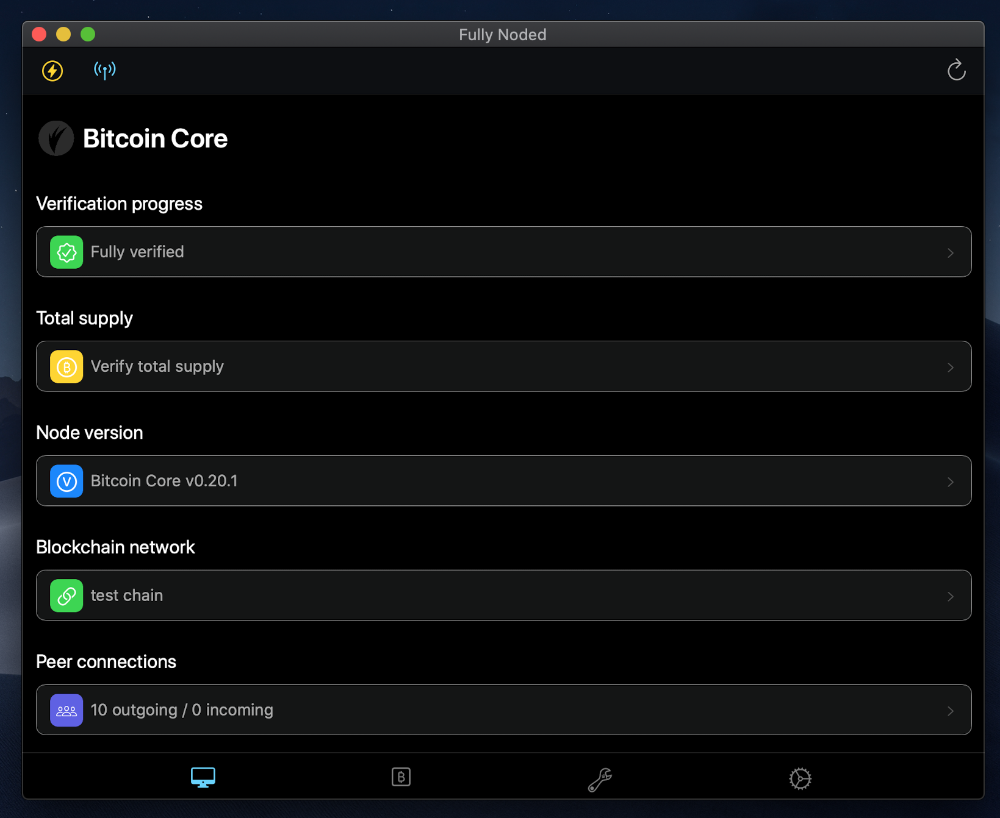
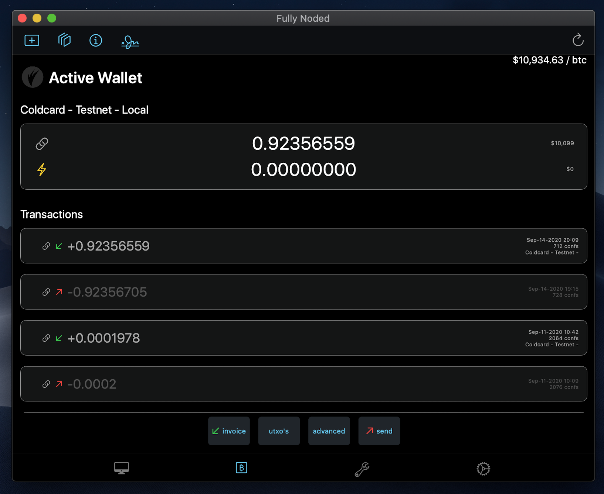

# Fully Noded®

     

   

Self sovereign, secure, powerful, easy to use **wallet** that utilizes your own [Bitcoin Core](https://github.com/bitcoin/bitcoin) node as a backend. Providing an easy to use interface to interact with your nodes non wallet capabilities. Fully Noded® wallets are powered by PSBT's and descriptors. Fully Noded® acts as an offline signer using your node as a watch-only wallet as well as giving you full unfettered access to every wallet.dat in your nodes `.bitcoin` directory. [C-Lightning](https://github.com/ElementsProject/lightning) and [LND](https://github.com/lightningnetwork/lnd) compatible for instant, unfairly cheap payments.

## App Store

[Fully Noded App Store](https://apps.apple.com/us/app/fully-noded/id1436425586) 

## Build from source

  
* Download Xcode
* `git clone https://github.com/Fonta1n3/FullyNoded.git`
* `cd FullyNoded`
* Double click `FullyNoded.xcodeproj`
* Click the play button in the top left bar of Xcode to run the app

## Releases

* Go to [releases](https://github.com/Fonta1n3/FullyNoded/releases)
* Download the `SHA256SUMS` file and open it with a text editor
* `FullyNoded.xxx.tar` and `source.zip` are signed with my pgp key `1C72 2776 3647 A221 6E02 E539 025E 9AD2 D3AC 0FCA`
* In a terminal run `shasum -a 256 FullyNoded.xxx.tar` (or whichever file you would like) the output should match what you see in the `SHA256SUMS` text file for the respective file.

## Getting started

- Requires you to be running Bitcoin Core.
- If configuring manually you can run [Tor-Connect](https://apps.apple.com/us/app/tor-connect/id6476699109?mt=12) to easily create a Tor hidden service to connect to your node, export the hidden service address, save it in node credentials in the address field. Optionally click and hold on the Tor-Connect icon in the dock. Choose Options and check or uncheck the Open at Login option to automatically launch Tor-Connect when your machine boots.
- Fully Noded will automatically create a "secure" rpc password for you, you can always edit it, copy the rpc auth text from and add that to your bitcoin.conf, save it and restart Bitcoin Core.
- Thats it, you should be connected.

## Cost

### Redistributing Fully Noded® Code on the App Store

Even though this project is open source, this does not mean you can reuse this code when distributing closed source commercial products. Please [contact us](mailto:dentondevelopment@protonmail.com) to discuss licensing options before you start building your product.

If you are an open source project, please [contact us](mailto:dentondevelopment@protonmail.com) to arrange for an App Store redistribution exception. For more information about why this is required, please read [this blog post](https://whispersystems.org/blog/license-update/) from Open Whisper Systems.

### Cost for End Users

Downloading the Fully Noded® iOS app is **100% free** because it is important that all people around the world have unrestricted access to a private, self sovereign means of using Bitcoin.
However, developing and supporting this project is hard work and costs real money. Please help support the development of this project!

* [GitHub Sponsors](https://github.com/sponsors/fonta1n3)

## Why Fully Noded®?

* **Privacy.** Majority of existing Bitcoin wallets are powered by someone else's node, this causes complete and utter loss of privacy. By running your own node and utilizing it via a Tor hidden service you are maintaining a high level of privacy.
* **Security.** All communications to your node are done within the Tor network, this means your IP is never exposed, your communications to your node are heavily encrypted, this is by default and not possible to opt out of. The app allows you to utilize Tor V3 authentication for first in class security, in short this means you self authenticate your device and no other device will be able to connect to your node. The app by default never uses your node as a hot wallet and instead keeps your seed heavily encrypted and securely stored on your iOS device, private keys never touch a network request, Tor or otherwise. With Fully Noded® architecture you can always keep your node completely behind a firewall and access it securely from anywhere in the world.
* **Sovereignty.** You are in total control, you run a self hosted server which then powers your mobile wallet. There is no middle man which can deny you access to your own server. You are in control of your private keys and utxo's.
* **Censorship Resistance.** If you rely on a companies' server to power your wallet you are inherently relying on them, they can at any time disable your connection to their servers, shut them off or be forced to deny you service. When using Fully Noded® you never have to be concerned about a third party censoring your payments, you are quite literally your own bank.
* **Recovery.** Users may recover any wallet with the app, simply create a Recovery wallet with BIP39 seed words and automatically recover every popular wallet in one fell swoop. For advanced users you may create a descriptor of any type and import it with the app, this allows every wallet type imaginable to be recovered. If you have existing wallets on your node which are watch-only you may add BIP39 seed words to the app to make them spendable.

## Manual Setup - *advanced*

* [Connect your existing node's](./Docs/Bitcoin-Core/Connect.md)
* [Manually setup Tor](./Docs/Tor/Tor.md)
* [Tor V3 Authentication](./Docs/Tor/Authentication.md)

## [Docs](./Docs)

* [Wallet usage](./Docs/Wallets)
* [Bitcoin Core (node) related](./Docs/Bitcoin-Core)
* [Importing a wallet from Specter](./Docs/Wallets/Specter.md)
* [Quick Connect uri](./Docs/Quick-Connect-QR.md)
* [How does it work?](./Docs/How-does-it-work.md)
* [Recovery](./Docs/Wallets/Recovery.md)
* [Lightning](./Docs/Lightning.md)

## Medium Posts

* [Introducing Fully Noded Wallets](https://medium.com/@FullyNoded/introducing-fully-noded-wallets-9fc2e4837102)
* [Introducing Fully Noded PSBT Signers](https://medium.com/@FullyNoded/introducing-fully-noded-psbt-signers-8f259c1ec558?sk=fa56fa3939136f269f0ca2a4fcdeee38)

## Youtube Tutorials

* [Get started](https://www.youtube.com/watch?v=_7MZd0weDis)
* [Set and reset a password to lock the app, enable and disable biometrics](https://www.youtube.com/watch?v=IGTEncREFCY)
* [Coldcard single signature wallet](https://www.youtube.com/watch?v=W0vwgzIrPoY)
* [Coldcard multi signature wallet](https://www.youtube.com/watch?v=daXvAcHy8H0)
* [Create, spend from and recover a multisig wallet](https://www.youtube.com/watch?v=-Eh-OdtFRmI)
* [Import xpub](https://www.youtube.com/watch?v=UsLd6ki5K4o)
* [Coin Control](https://www.youtube.com/watch?v=F7Uw6C1XWf0)
* [Batching](https://www.youtube.com/watch?v=pDWTsYzG4uc)
* [DIY Coinjoins](https://www.youtube.com/watch?v=O_MS9LD9otI)
* [Wallet Details](https://www.youtube.com/watch?v=PawTXdmYNVc)

## PGP

* 1C72 2776 3647 A221 6E02  E539 025E 9AD2 D3AC 0FCA

## Contributing

Thank you for your interest in contributing to Fully Noded®! To avoid potential legal headaches and to allow distribution on Apple's App Store please sign our CLA (Contributors License Agreement).

1. Sign the [CLA](./CLA.md), and email it to [dentondevelopment@protonmail.com](mailto:dentondevelopment@protonmail.com).
2. [Fork](https://github.com/Fonta1n3/FullyNoded/fork) the project and (preferably) work in a feature branch.
3. Open a [pull request](https://github.com/Fonta1n3/FullyNoded/pulls) on GitHub adding your signed CLA [here](./CLA-signed).
4. All commits must be pgp signed, see [this guide](https://docs.github.com/en/enterprise/2.14/user/articles/signing-commits).
5. Thank you!

## License

MIT
"Commons Clause" License Condition v1.0

If you would like to relicense this code to distribute it on the App Store,
please contact me at [dentondevelopment@protonmail.com](mailto:dentondevelopment@protonmail.com).

## Third-party Libraries

This software additionally references or incorporates the following sources
of intellectual property, the license terms for which are set forth
in the sources themselves:

* Credit to [Chat-Secure](https://github.com/ChatSecure/ChatSecure-iOS/blob/master/README.md) Readme.md for inspiring the layout/format and some of the text of this document.
* Credit to [Blockchain Commons](https://github.com/BlockchainCommons) for the format of the CLA.

The following dependencies are bundled with the Fully Noded®, but are under
terms of a separate license:

* [secp256k1.swift](https://github.com/GigaBitcoin/secp256k1.swift) for schnoor signing nostr events and other nostr stuff.
* [RNCryptor](https://github.com/RNCryptor/RNCryptor) for encrypting nostr events.
* [Tor](https://github.com/iCepa/Tor.framework) for connecting to your node more privately and securely.
* [Libwally-Swift](https://github.com/Fonta1n3/libwally-swift) which relies on [Libwally-Core v0.7.7](https://github.com/Fonta1n3/libwally-swift/tree/master/CLibWally/libwally-core) for converting cryptographically secure entropy to BIP39 words, deriving HD keys and most importantly signing psbt's.
* [DescriptorParser.swift](https://github.com/BlockchainCommons/GordianWallet-iOS/blob/master/XCode/GordianWallet/Helpers/DescriptorParser.swift) from [Blockchain Commons](https://github.com/BlockchainCommons) which is under the [spdx:BSD-2-Clause Plus Patent License](https://spdx.org/licenses/BSD-2-Clause-Patent.html).
* [Base32](https://github.com/norio-nomura/Base32/blob/master/Sources/Base32) built by [@norio-nomura](https://github.com/norio-nomura) - for Tor V3 authentication key encoding which is licensed under The MIT License (MIT).
* [Base58](https://github.com/wavesplatform/Base58/tree/master/Source) from [@LukeDash-jr](https://github.com/luke-jr) and the [Waves Platform](https://github.com/wavesplatform) which is licensed under The MIT License (MIT). Used for converting Slip0132 extended keys to xpubs/xprvs.
* The contents of the [UR](https://github.com/Fonta1n3/FullyNoded/tree/master/FullyNoded/Helpers/UR) directory (excluding the [UR.swift](https://github.com/Fonta1n3/FullyNoded/blob/master/FullyNoded/Helpers/UR/UR.swift) file which falls under Fully Noded license) from [Blockchain Commons](https://github.com/BlockchainCommons) which is under the [spdx:BSD-2-Clause Plus Patent License](https://spdx.org/licenses/BSD-2-Clause-Patent.html). 
