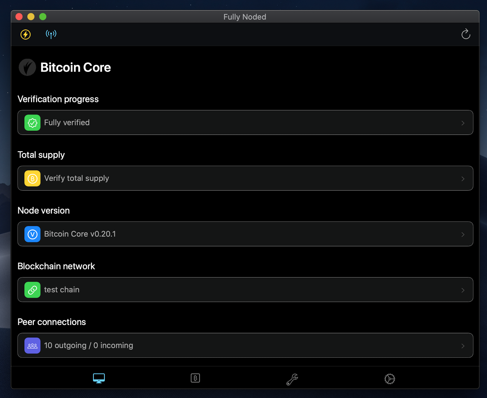
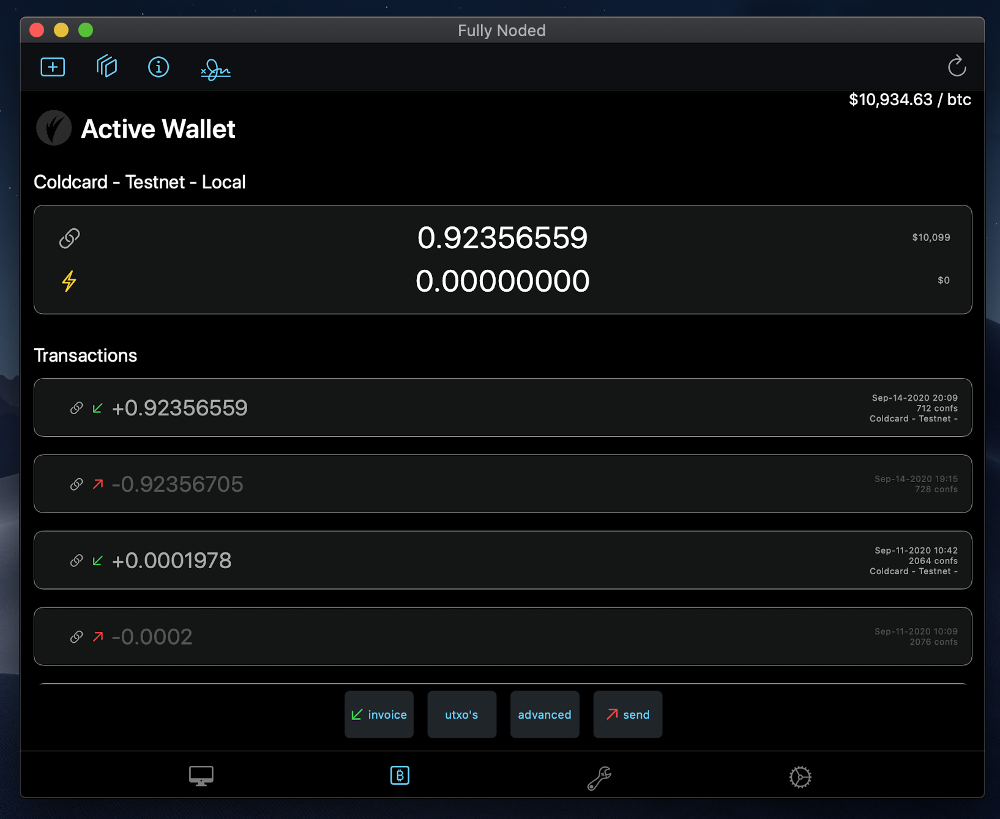
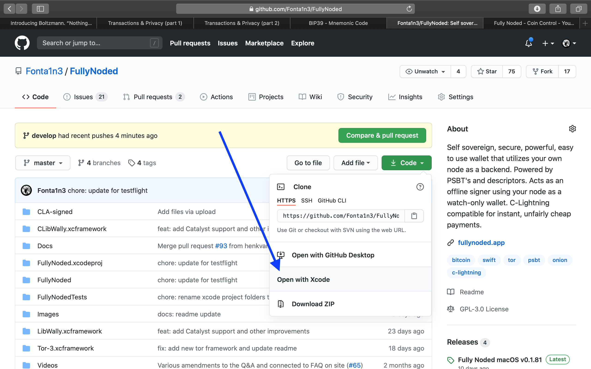

# Fully Noded®

     

   

Self sovereign, secure, powerful, easy to use **wallet** that utilizes your own [Bitcoin Core](https://github.com/bitcoin/bitcoin) node as a backend. Providing an easy to use interface to interact with your node. Fully Noded® wallets are powered by PSBT's and descriptors. Fully Noded® acts as an offline signer using your node as a watch-only wallet as well as giving you full unfettered access to every wallet.dat in your nodes `.bitcoin` directory.

## App Store

[Fully Noded App Store](https://apps.apple.com/us/app/fully-noded/id1436425586) 

Want to run a node on your Mac? Download [Fully Noded Server](https://fullynoded.app/wp-content/uploads/2025/11/fullynoded-server-v0.2.1.zip), it installs and configures Bitcoin Core, Knots, Join Market and Tor to make getting Fully Noded a breeze.

## Build from source

  
* Download Xcode
* `git clone https://github.com/Fonta1n3/FullyNoded.git`
* `cd FullyNoded`
* `pod update`
* Double click `FullyNoded.xcworkspace`
* Click the play button in the top left bar of Xcode to run the app

## Support the app

* You can donate to me and support the app directly by navigating to the send view and tapping the donate button, this adds a donation address that I control, your support is greatly appreciated and will directly fund the app.
* [GitHub Sponsors](https://github.com/sponsors/fonta1n3)
* Many thanks to [OpenSats](https://opensats.org) and [Human Rights Foundation](https://hrf.orf) for supporting my work in the past, this has helped Fully Noded apps come a long way and is greatly appreciated, consider directly donating to these organizations!

## Why Fully Noded®?

* **Privacy.** Majority of existing Bitcoin wallets are powered by someone else's node, this causes complete and utter loss of privacy. By running your own node and utilizing it via a Tor hidden service you are maintaining a high level of privacy.
* **Security.** Communications to your node are done within the Tor network (unless using localhost or LAN), this means your IP is never exposed, your communications to your node are heavily encrypted. The app allows you to utilize Tor V3 authentication for first in class security.
* **Sovereignty.** You are in total control, you run a self hosted server which then powers your mobile wallet. There is no middle man which can deny you access. You are in control of your private keys and utxo's.
* **Censorship Resistance.** If you rely on a companies' server to power your wallet you are inherently relying on them, they can at any time disable your connection to their servers, shut them off or be forced to deny you service. When using Fully Noded® you never have to be concerned about a third party censoring your payments, you are quite literally your own bank.
* **Output Descriptor Support.** You can import any descriptor into FN and it should work seamlessly. Multisig, miniscript, segwit, taproot and more.
* **HWW Functionality.** FN Signers tab allows you to add BIP39 mnemonics and passphrases and stores the mnemonic double encrypted locally on your device. It signs transactions locally with no internet connection required.

## PGP

* 297D 3AA6 F231 4CD0 E023  CD9B 7C85 7452 1475 38F5

## License

GNU General Public License v3.0

If you would like to relicense this code to distribute it on the App Store,
please contact me at [dentondevelopment@protonmail.com](mailto:dentondevelopment@protonmail.com).

## Third-party Libraries

The following dependencies are bundled with the Fully Noded®, but are under
terms of a separate license:

* [Tor](https://github.com/iCepa/Tor.framework) for connecting to your node more privately and securely.
* [Libwally-Swift](https://github.com/Fonta1n3/libwally-swift) which relies on [Libwally-Core v0.7.7](https://github.com/Fonta1n3/libwally-swift/tree/master/CLibWally/libwally-core) for converting cryptographically secure entropy to BIP39 words, deriving HD keys and most importantly signing psbt's.
* [Base32](https://github.com/norio-nomura/Base32/blob/master/Sources/Base32) built by [@norio-nomura](https://github.com/norio-nomura) - for Tor V3 authentication key encoding which is licensed under The MIT License (MIT).
* [Base58](https://github.com/wavesplatform/Base58/tree/master/Source) from [@LukeDash-jr](https://github.com/luke-jr) and the [Waves Platform](https://github.com/wavesplatform) which is licensed under The MIT License (MIT). Used for converting Slip0132 extended keys to xpubs/xprvs.
* The contents of the [UR](https://github.com/Fonta1n3/FullyNoded/tree/master/FullyNoded/Helpers/UR) directory (excluding the [UR.swift](https://github.com/Fonta1n3/FullyNoded/blob/master/FullyNoded/Helpers/UR/UR.swift) file which falls under Fully Noded license) from [Blockchain Commons](https://github.com/BlockchainCommons) which is under the [spdx:BSD-2-Clause Plus Patent License](https://spdx.org/licenses/BSD-2-Clause-Patent.html). 
