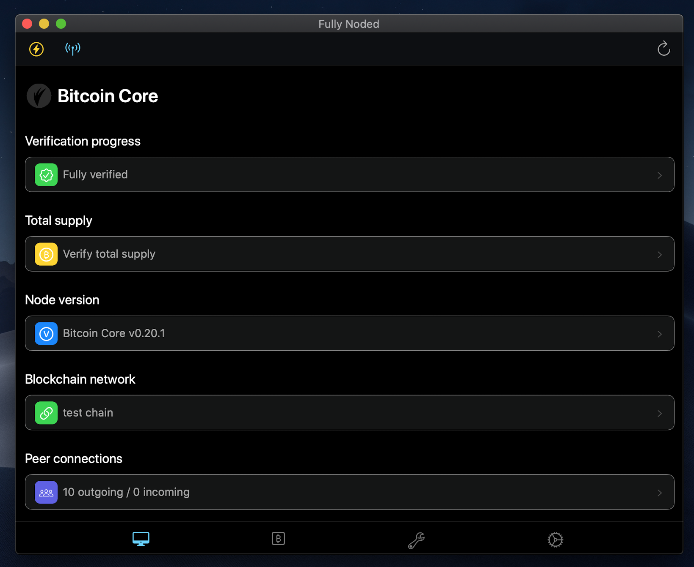
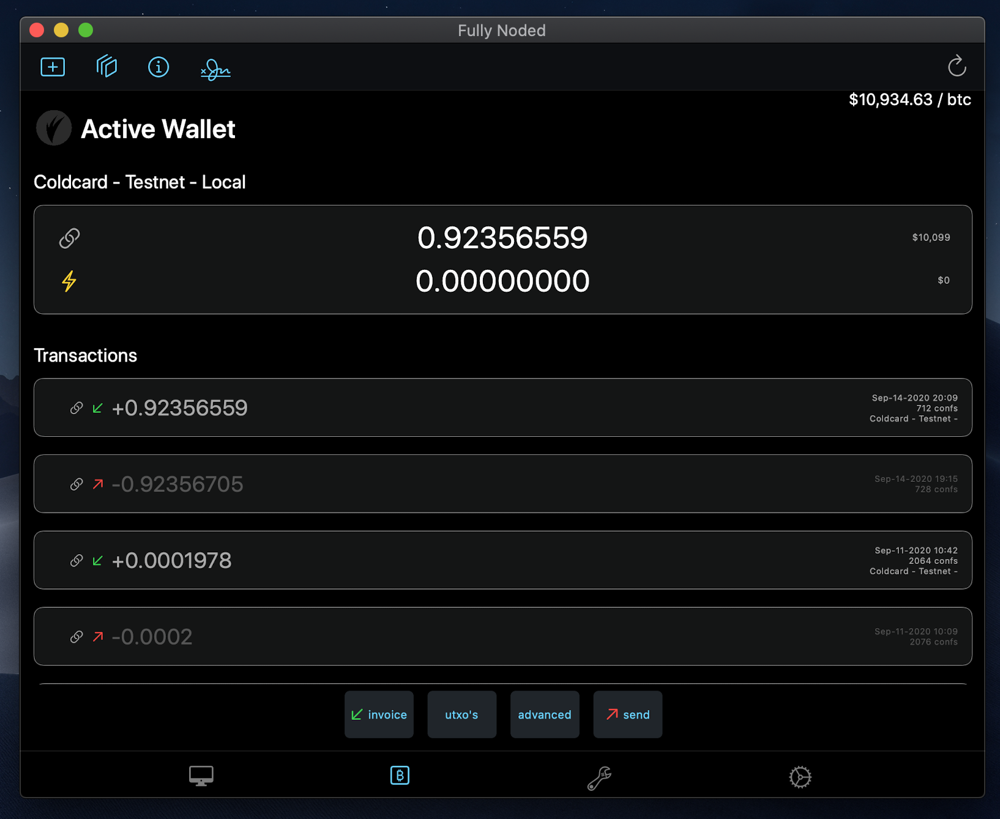
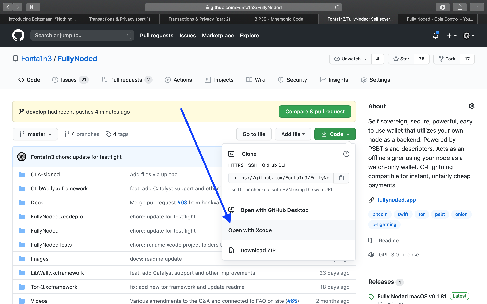

# Fully Noded®

     

   

Self sovereign, secure, powerful, easy to use **wallet** that utilizes your own [Bitcoin Core](https://github.com/bitcoin/bitcoin) node as a backend. Providing an easy to use interface to interact with your node. Fully Noded wallets are powered by PSBT's and descriptors. Fully Noded acts as an offline signer using your node as a watch-only wallet as well as giving you access to your nodes existing wallets.

## App Store

[Fully Noded App Store](https://apps.apple.com/us/app/fully-noded/id1436425586) 

Want to run a node on your Mac? Download [Fully Noded Server](https://fullynoded.app/wp-content/uploads/2025/11/fullynoded-server-v0.2.1.zip), it installs and configures Bitcoin Core, Knots, Join Market and Tor to make getting Fully Noded a breeze.

## Build from source

  
* Download Xcode
* `git clone https://github.com/Fonta1n3/FullyNoded.git`
* `cd FullyNoded`
* `pod update`
* Double click `FullyNoded.xcworkspace`
* Click the play button in the top left bar of Xcode to run the app

## Support the app

* You can donate to me and support the app directly by navigating to the send view and tapping the donate button, this adds a donation address that I control, your support is greatly appreciated and will directly fund the app.
* [GitHub Sponsors](https://github.com/sponsors/fonta1n3)
* Many thanks to [OpenSats](https://opensats.org) and [Human Rights Foundation](https://hrf.orf) for supporting my work in the past, this has helped Fully Noded apps come a long way and is greatly appreciated, consider directly donating to these organizations!

## Why Fully Noded®?

* **Privacy.** Majority of existing Bitcoin wallets are powered by someone else's node, this causes complete and utter loss of privacy. By running your own node and utilizing it via a Tor hidden service you are maintaining a high level of privacy.
* **Security.** Communications to your node are done within the Tor network (unless using localhost or LAN), this means your IP is never exposed, your communications to your node are heavily encrypted. The app allows you to utilize Tor V3 authentication for first in class security.
* **Sovereignty.** You are in total control, you run a self hosted server which then powers your mobile wallet. There is no middle man which can deny you access. You are in control of your private keys and utxo's.
* **Censorship Resistance.** If you rely on a companies' server to power your wallet you are inherently relying on them, they can at any time disable your connection to their servers, shut them off or be forced to deny you service. When using Fully Noded® you never have to be concerned about a third party censoring your payments, you are quite literally your own bank.
* **Output Descriptor Support.** You can import any descriptor into FN and it should work seamlessly. Multisig, miniscript, segwit, taproot and more.
* **HWW Functionality.** FN Signers tab allows you to add BIP39 mnemonics and passphrases and stores the mnemonic double encrypted locally on your device. It signs transactions locally with no internet connection required.

## Silent Payments (BIP352)

> 🧪 Experimental: in development on the `Silent-Payments` branch. Test with small amounts.

Silent payments give you **one static address you can share anywhere**, such as a website, donation page, invoice footer or Nostr profile, **without ever reusing an address on-chain**. Every payment to your `sp1…` address lands on a brand new, unique Taproot output that only you can find and spend.

**Why they're awesome**

* **Reusable address, zero address reuse.** Post it once and forget about it. Payments can't be linked to each other or to your published address by anyone watching the chain.
* **No interaction.** The sender doesn't need to ask you for a fresh address, and you don't need to be online when they pay.
* **No notification transaction, no third party.** Unlike BIP47 there is no on-chain setup step, and no server ever holds your xpub. Fully Noded does the scanning with your own node via [Fully Noded Server](https://fullynoded.app).
* **Blends in.** Silent payment outputs look like any other Taproot output, so they improve privacy for everyone using Taproot.
* **Watch and spend keys are separate.** The scan key can only *see* incoming payments. Spending needs the spend key, which never leaves your Fully Noded signer.

**How it works (high level)**

1. **Your address is two public keys.** A silent payment address is a *scan* key and a *spend* key, both derived from your signer's seed (`m/352'/coin'/0'/1'/0` and `m/352'/coin'/0'/0'/0`).
2. **The sender makes a shared secret.** Their wallet combines the private keys of the inputs it's spending with your public scan key (an ECDH key exchange). That secret tweaks your spend key into a one-time Taproot output that nobody else can link to you.
3. **You find it with the same secret.** Your node looks at each new block's transactions. It combines each transaction's input *public* keys with your *private* scan key, which gives the same shared secret, and checks whether any output matches. Matches are imported into your node as watch-only coins.
4. **You spend it with the tweak.** Your spend private key plus that output's tweak is the key that signs. Only the device holding your seed can do that.

**In Fully Noded**

* **Receive:** the signer detail screen shows your `sp1…` address with a QR export.
* **Send:** paste an `sp1…` / `tsp1…` address in the send view. Fully Noded computes the one-time output and the PSBT goes through the normal transaction verifier.
* **Scan:** export your scan private key from the signer detail screen (QR, authentication required) and import it, with your address, into Fully Noded Server (Utilities → Silent Payments). It watches the chain with your own node and imports what it finds, watch-only, into your Fully Noded wallet.
* **Spend:** the transaction verifier recognises silent payment inputs and signs them with the tweaked key. Normal inputs are signed as usual.

For the full technical details see **[SilentPayments.md](./SilentPayments.md)**: key derivation, sending, scanning, rescans and spending, plus current limitations and caveats.

## PGP

* 9E3F 8A38 C100 8D95 FEB9  1D08 0BF9 9EAD 77F9 FFAA

## License

GNU General Public License v3.0

If you would like to relicense this code to distribute it on the App Store,
please contact me at [dentondevelopment@protonmail.com](mailto:dentondevelopment@protonmail.com).

## Third-party Libraries

The following dependencies are bundled with the Fully Noded®, but are under
terms of a separate license:

* [bdk-swift](https://github.com/bitcoindevkit/bdk-swift) for signing PSBTs, local psbt creation/parsing, bip32 key derivation, mini-script functionality, BIP39 mnemonics (it replaced Libwally, which is no longer used).
* [Tor](https://github.com/iCepa/Tor.framework) for connecting to your node more privately and securely.
* [Base32](https://github.com/norio-nomura/Base32/blob/master/Sources/Base32) built by [@norio-nomura](https://github.com/norio-nomura) - for Tor V3 authentication key encoding which is licensed under The MIT License (MIT).
* [Base58](https://github.com/wavesplatform/Base58/tree/master/Source) from [@LukeDash-jr](https://github.com/luke-jr) and the [Waves Platform](https://github.com/wavesplatform) which is licensed under The MIT License (MIT). Used for converting Slip0132 extended keys to xpubs/xprvs and decoding extended keys.
* The contents of the [UR](https://github.com/Fonta1n3/FullyNoded/tree/master/FullyNoded/Helpers/UR) directory (excluding the [UR.swift](https://github.com/Fonta1n3/FullyNoded/blob/master/FullyNoded/Helpers/UR/UR.swift) file which falls under Fully Noded license) from [Blockchain Commons](https://github.com/BlockchainCommons) which is under the [spdx:BSD-2-Clause Plus Patent License](https://spdx.org/licenses/BSD-2-Clause-Patent.html). 
